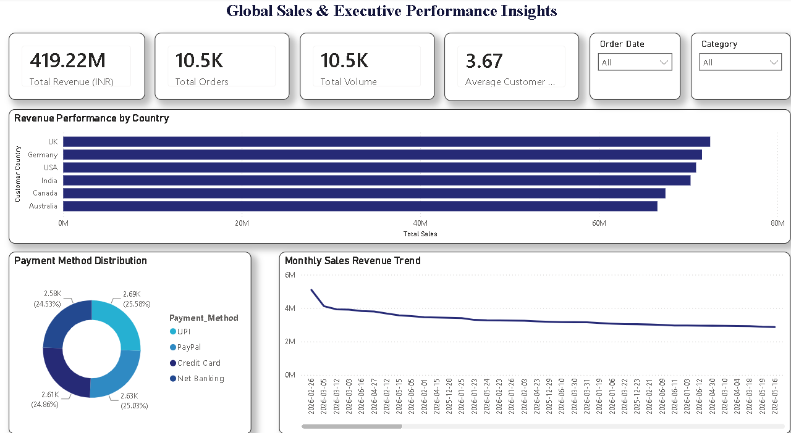

# Enterprise Cloud ETL Pipeline: Marketing & E-Commerce Analytics

An end-to-end cloud data engineering and business intelligence pipeline that automates web data extraction, programmatically scales transactional structures, hosts serverless objects in a cloud data lake, and delivers production-ready executive dashboards.

---

## Solution Architecture

```text
┌───────────────────┐
│   FakeStore API   │
└─────────┬─────────┘
          │
          ▼
┌───────────────────┐
│ Python ETL Layer  │
│ Requests + Pandas │
└─────────┬─────────┘
          │
          ▼
┌───────────────────┐
│ Data Processing   │
│ Scaling & Cleanup │
└─────────┬─────────┘
          │
          ▼
┌───────────────────┐
│ Amazon S3 Bucket  │
│   Data Lake       │
└─────────┬─────────┘
          │
          ▼
┌───────────────────┐
│ Amazon Athena     │
│ SQL Query Engine  │
└─────────┬─────────┘
          │
          ▼
┌───────────────────┐
│ Power BI          │
│ Executive Reports │
└───────────────────┘
```

---

## Architectural Workflow and Data Engineering Stages

### 1. Programmatic API Extraction (Ingestion Layer)
*   **The Ingestion Strategy:** Developed a Python ingestion script using the `requests` library to fetch active product feeds directly from a live web configuration endpoint (`fakestoreapi.com/products`).
*   **Response Handling:** Built strict programmatic validation checks (`response.status_code == 200`) to guarantee transaction payload integrity before triggering memory allocations.

### 2. In-Memory Transformation and Data Augmentation (Processing Layer)
*   **E-Commerce Data Scaling:** Since the raw API response constraints baseline feeds to 20 unique product definitions, an analytical simulation loop was constructed using the Python `random` module to dynamically scale rows to over 10,500 transactional records.
*   **Data Normalization and Business Logic:**
    *   **Currency Normalization:** Converted source price points from USD to INR using an explicit corporate standardization multiplier factor (`price * 84`) and restricted continuous floats using `round(..., 2)`.
    *   **Primary Key Integrity:** Enforced unique transactional primary keys structured sequentially starting at `TXN-100001` to eliminate identity collisions during cloud joins.
    *   **Temporal Distribution Plotting:** Applied random 180-day integer bounds using `timedelta` constraints to programmatically simulate a realistic rolling 6-month historical historical timeline across global markets.

### 3. Volatile Storage Streaming and Cloud Upload (Load Layer)
*   **Memory Optimization:** Avoided expensive physical server disk I/O bottlenecks by compiling the processed transactional arrays inside a Pandas DataFrame and streaming the serialization buffer entirely within system RAM utilizing `io.StringIO()`.
*   **S3 Landing Zone Security:** Configured the Amazon Web Services Boto3 Software Development Kit (`boto3.client('s3')`) to push the object (`big_marketing_sales_data.csv`) directly from volatile memory parameters into an encrypted destination bucket (`utkarsh-marketing-sales-data`) via strict AWS IAM access credentials.

### 4. Serverless Cloud Warehousing & BI Connect (Reporting Layer)
*   **Serverless Query Execution:** Positioned Amazon Athena directly over the raw S3 landing layer, defining custom Data Definition Language (DDL) schemas using OpenCSVSerde constraints to isolate embedded text field punctuations.
*   **Programmatic Access Bypass:** Successfully bypassed local machine ODBC/DSN gateway driver dependencies by injecting an embedded Python streaming query block using automated IAM key handshakes inside Power BI Desktop, optimizing performance and reducing enterprise database compute costs.

---

## Technical Infrastructure

*   **Languages:** Python 3 (Pandas, Boto3, Requests, StringIO), SQL (ANSI SQL / Amazon Athena Engine)
*   **Cloud Computing Architecture:** Amazon Web Services (AWS S3 Storage Layer, Amazon Athena Query Layer, IAM Identity Systems)
*   **Business Intelligence Platform:** Power BI Desktop Architecture (In-Memory VertiPaq Import Storage Engine)

---

## Operational Database Metrics and Executive Dashboard

The automated architecture directly feeds a high-density executive reporting layer tracking major commercial KPIs:

*   **Total Scaled Revenue Volume:** 419.22M INR (Successfully optimized layout constraints to force a hard two-decimal ceiling across all reporting tiles for quick executive scannability).
*   **Market Share Distribution:** Tracks continuous transaction frequency across primary geographical hubs including India, USA, UK, Canada, Germany, and Australia.
*   **Data Anomaly Isolation Summary:** Operational validation filters successfully intercepted 69 empty string elements inside historical payment classifications, parsing them programmatically to preserve absolute visual matrix accuracy without introducing tracking skews.



---

## Critical Engineering Bottlenecks and Strategic Solutions

*   **The Structural Spillage Challenge:** Raw transactional names often contain structural comma values which corrupt relational schemas during basic text scanning, leading to incorrect calculations downstream.
    *   *The System Optimization:* Configured the AWS Glue/Athena parser engine properties explicitly utilizing `WITH SERDEPROPERTIES ('quoteChar' = '"')` to enforce strict character handling rules, locking alphanumeric values in place.
*   **The Ingestion Gateway Bottleneck:** Enterprise server configurations frequently block explicit local ODBC/DSN desktop connections due to security firewalls.
    *   *The System Optimization:* Developed a programmatic data ingestion block using custom Python connector logic embedded right inside the Power BI data source pipeline to securely fetch the compiled staging file directly through native cloud endpoint requests.
